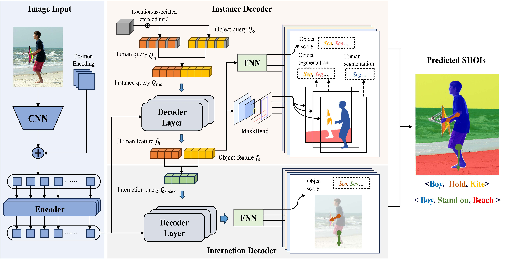
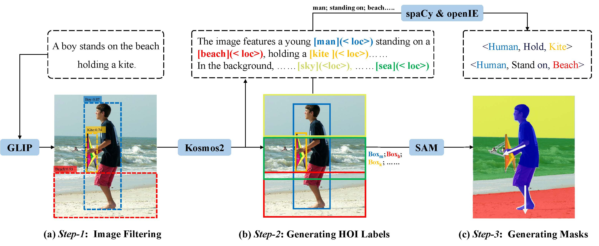

## Abstract

Prevailing works tackle the Human-object Interaction (HOI) task from a detection perspective, focusing on detecting bounding boxes of humans and objects and predicting interactions of human-object pairs. We argue that such a paradigm at the granularity of proposal bounding boxes can not produce accurate HOI detection results. In this work, we introduce a new task, pixel-level Segmentation-grounded Human-object Interaction (SHOI) detection, aiming to identify more accurate HOIs using {pixel-level masks} instead of coarse-grained bounding boxes. Three SHOI benchmark datasets, namely VS-COCO, HICO-SG, and InterSeg, with more than one million images in total, are curated for the community to conduct further research. For the benchmark, we build three two-stage baselines and two one-stage baselines, all modified from classic HOI methods. Additionally, we propose a new one-stage model, namely SHOIFormer, based on the Transformer architecture with two parallel decoders, for instance segmentation and interaction prediction respectively.

## Datastes

We present construct three SHOI datasets. 
For more comprehensive construction details and dataset statistic, please refer to the paper.

### Automated Construction of SHOI Dataset using Pipeline
In this study, we introduce a novel approach for the automated creation of Spatial Human-Object-Interaction (SHOI) datasets.  Our method leverages segmentation models in conjunction with multimodal large-scale models within a cohesive pipeline.  This pipeline facilitates the seamless generation of SHOI datasets, thereby streamlining the data acquisition process.
### Enhancement of Existing and Widely Used HOI Datasets
Furthermore, we contribute to the advancement of the field by enhancing existing and widely adopted Human-Object-Interaction (HOI) datasets.  Through careful curation and augmentation techniques, we improve the quality and diversity of the dataset, addressing potential limitations present in conventional datasets.  

For more examples of image datasets, please refer to the Datasets folder.

